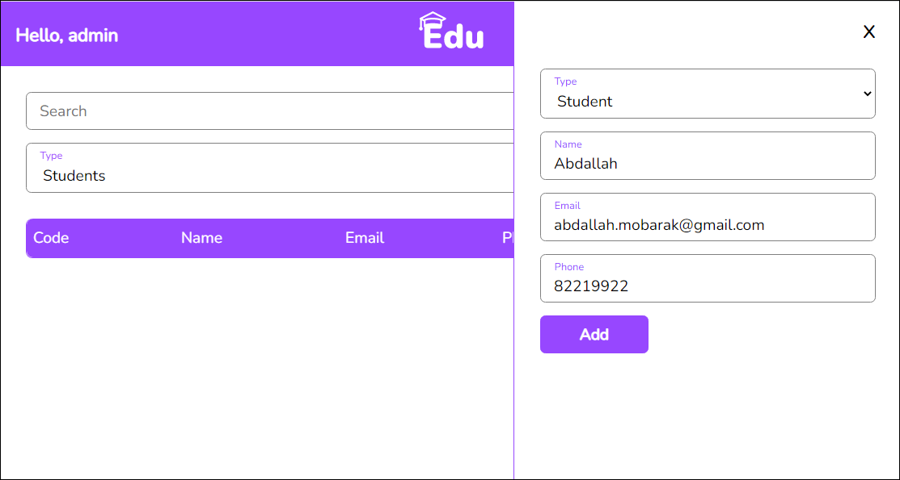
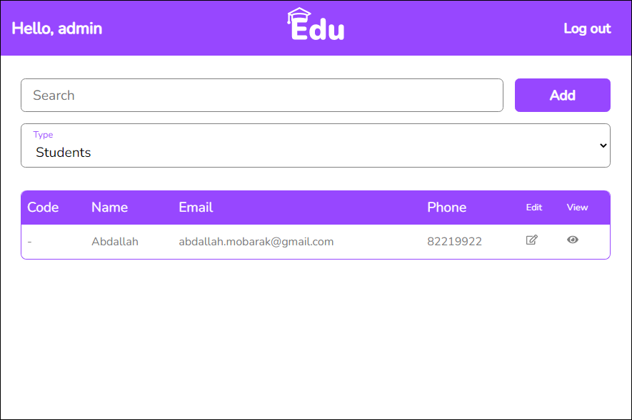
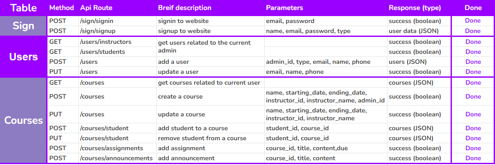

# E-Learning System

⭐ Implement an e-learning system using Laravel, React and MongoDB:

##### Stack:

---

#### 🎯 Requirements

- Admins shall be able to add instructors, students and courses.
- Admins shall be able to assign instructors to courses.
- Instructors shall be able to add students.
- Instructors shall be able to create assignments.
- Instructors shall be able to create announcements.
- Students shall be able to view and submit assignments.
- Students shall be able to view their enrolled courses.

📅 Deadline: Tuesday, October 11th, at 11:59 PM

---

## ✨TEAM Members

#### - Fullstack developer & Designer:

<a href='https://github.com/abdallahmoubarak'>Abdallah Moubarak

</a>

---

## 🎯 Project Process

#### Stage 1: creating ER diagram for the project

\*Having a schema instead of this.

---

#### Stage 2: Creating Figma design

Figma design:

---

#### Stage 3: Creating List of API's needed for the project

---

#### Stage 4: Creating main branch, and master bransh for the project

repo link : https://github.com/abdallahmoubarak/e-learning-system-laravel-react-mongodb

- Substage 1 : developing frontend pages using (reactjs)
- Substage 2 : implementing Laravel
- Substage 3 : listing APIs
- Substage 4 : fitting API's in frontend (react-query)

---

